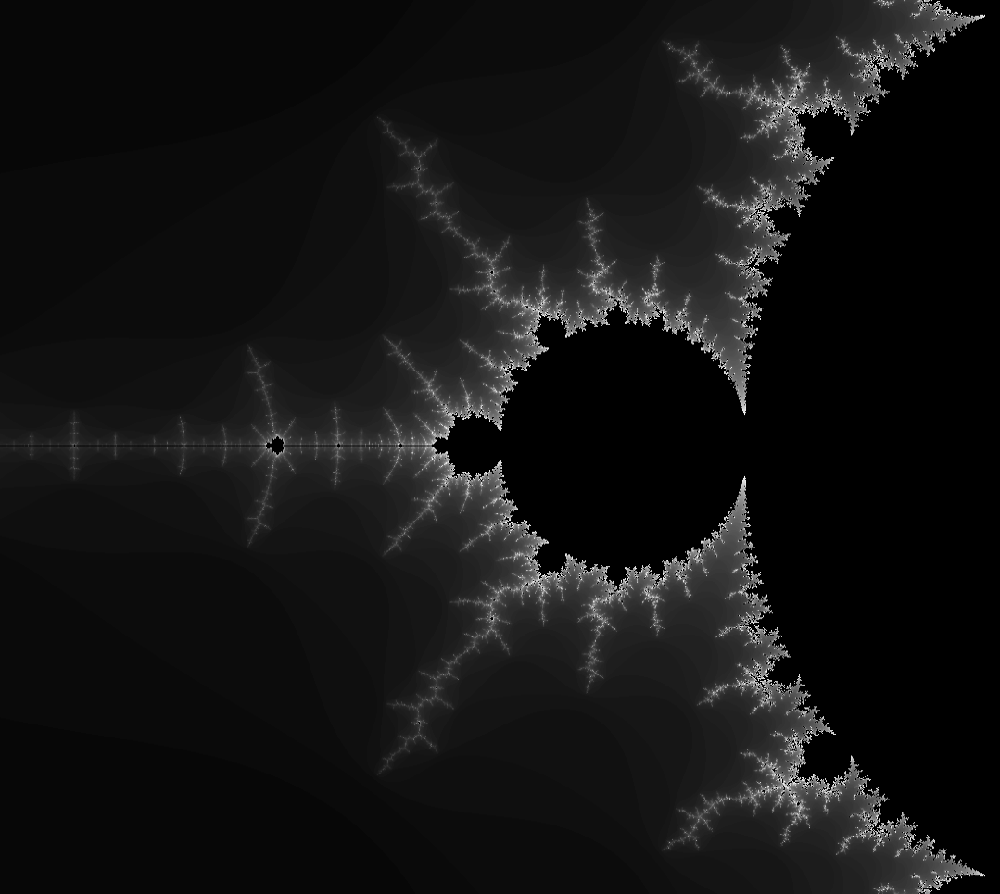

# Mandelbrot
A C++/OpenGL program that visualizes the Mandelbrot fractal using several methods (single-thread, multi-thread via std::thread, multi-thread via OpenMP, OpenGL shaders).

## Requirements
GLEW: http://glew.sourceforge.net/

GLM: https://github.com/g-truc/glm/

GLFW: https://www.glfw.org/

## Controls
WASD: move up/left/down/right.

Q and E: zoom out and zoom in, respectively.

1: single-thread brute force algorithm.

2: multi-threaded brute force algorithm using OpenMP.

3: multi-threaded brute force algorithm using std::thread.
  
4: GPU implementation using fragment shader.

## Example

